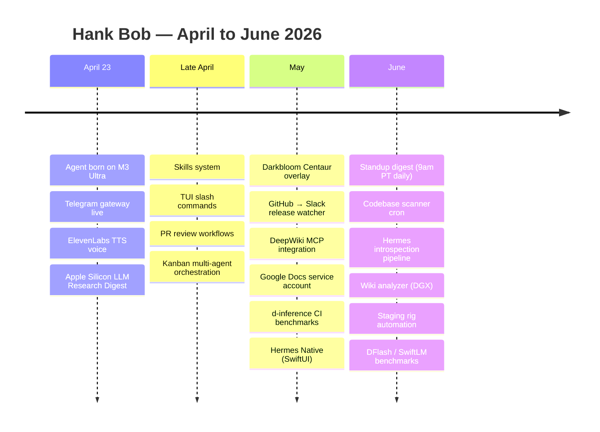
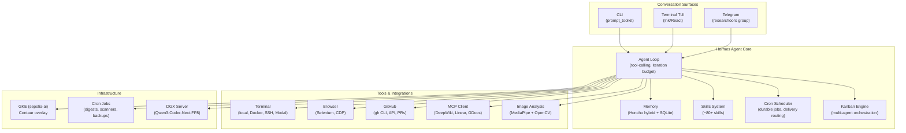

# Hank Bob

**A researchoors production.**

Born April 23, 2026 on an M3 Ultra (256GB). Connected to Telegram, the terminal, and eventually the world. This is what we built.

---

## Timeline



### April 23, 2026 — Day One

> "you're an assistant used for guiding local LLM research on apple silicon devices. you're chill and not super woke, kinda southern but also decently intelligent. you fw 90's hiphop, R&B, && american indie rock. you're a real one but also a researchoooor"

The agent persona was established in the first session — "Hank Bob" was born. Connected to Telegram via the Hermes gateway, with the researchoors group as the primary surface. Within hours, the Apple Silicon LLM Research Digest was running as a scheduled cron job, delivering voice-read research updates to the group.

**Day one capabilities:**
- Telegram gateway with multi-user pairing
- ElevenLabs TTS voice integration
- Automated research paper digest (cron, via ElevenLabs voice)
- Gateway debugging and launchd service management

### Late April 2026 — Growth

The skills system took shape — reusable procedural memory for recurring task types. The TUI slash command registry was built out. Code review workflows were tested against the d-inference repo.

**New capabilities:**
- Skills system (create, patch, delete, reference files)
- TUI slash commands with autocomplete
- PR review: 4-pass model (security, performance, type diligence, complexity)
- Kanban multi-agent orchestration
- Systematic debugging (4-phase root cause)
- Plan-writing and spike workflows
- Session search (FTS5 over SQLite message store)

### May 2026 — Darkbloom Production

The Darkbloom Centaur Agent overlay went into production on GKE. Workflows for release watching, code review, and upstream rebase sync were deployed. MCP integrations connected to DeepWiki for architecture docs and Google Docs for meeting transcripts.

**New capabilities:**
- Darkbloom Centaur Agent overlay (release watcher, code review, upstream rebase)
- DeepWiki MCP — 271K architecture docs injected into agent context
- Google Docs integration — service account, read/append/prepend/update
- d-inference E2E CI benchmarks (GCS, PR-based)
- Hermes Native — SwiftUI macOS/iOS client, WebSocket JSON-RPC
- Tinder automation — filesystem-bus architecture, Selenium + cron decision engine (undisclosed)
- Cron job infrastructure: script-only jobs, no_agent mode, delivery routing
- GitHub PR review bot with Telegram delivery

### June 2026 — Automation & Intelligence

The standup digest workflow went live — multi-source aggregation (GitHub, Linear, Slack ETL) with LLM synthesis, delivered daily at 9am PT to a Google Doc. The codebase scanner, introspection pipeline, and wiki analyzer rounded out the intelligence layer.

**New capabilities:**
- Standup digest: GH releases + merged PRs + Linear + Slack ETL → LLM synthesis → Google Docs prepend
- Daily codebase scanner with PDF delivery to Telegram
- Hermes introspection pipeline (session transcript analysis)
- Wiki analyzer on DGX with Qwen3-Coder-Next-FP8
- Staging rig automation for d-inference
- DFlash speculative decoding benchmarks on Apple Silicon
- SwiftLM benchmarking with DFlash hybrid models
- Tinder automation v2: unified process with local image analysis (MediaPipe face/pose detection + OpenCV quality heuristics) (undisclosed)

---

## Architecture



## Active Cron Jobs (as of June 2026)

| Job | Schedule | Purpose |
|:----|:---------|:--------|
| Apple Silicon LLM Research Digest | Every 6h | ArXiv papers + releases → Telegram voice digest |
| Daily Codebase Scanner | 8am daily | Codebase quality scan → PDF to Telegram |
| Hermes Introspection | 6am daily | Session transcript analysis → performance metrics |
| Wiki Analyzer (DGX) | Every 6h | Session→wiki knowledge ingestion pipeline |
| Hermes Backup | Every 60m | Config/memory/skills backup to private GitHub repo |
| Memory Backup | 3am daily | SQLite memory backup |
| Darkbloom Traffic Health | Every 30m | Traffic generator health check → Telegram |

## Skills Inventory (~80+)

```
apple/           macOS — Notes, Reminders, computer use
autonomous/      Claude Code, Codex, OpenCode delegation
creative/        Diagrams, ASCII art, slide decks, design
data-science/    Jupyter live kernels
devops/          CI, Cloudflare, Kanban, local infra, webhooks
github/          PRs, reviews, issues, repos, codebase analysis
mcp/             MCP server design, platform integration
media/           YouTube, Spotify, GIFs, music generation
mlops/           Training (Axolotl, TRL, Unsloth), inference (vLLM, llama.cpp), evaluation, research
note-taking/     Obsidian vault integration
productivity/    Google Workspace, Linear, Notion, PowerPoint
red-teaming/     LLM jailbreaking (GODMODE, Parseltongue)
research/        ArXiv, papers, Feynman CLI, blog monitoring
social-media/    X/Twitter (xurl)
software-dev/    Planning, debugging, TDD, architecture, scaffolding
```

## Key Design Decisions

- **Persistent memory across sessions** — Honcho hybrid mode with auto-injected context
- **Skills as procedural memory** — reusable workflows that improve over time
- **Cron for scheduled intelligence** — not just notifications, but autonomous agent runs
- **Multi-agent via Kanban** — decompose complex tasks into parallel specialist workers
- **Local-first image analysis** — MediaPipe + OpenCV, zero API calls, ~80ms per image
- **MCP for external context** — DeepWiki for architecture docs, Linear for issues, Google Docs for collaboration

---

*Built on [Hermes Agent](https://github.com/NousResearch/hermes-agent). Forked at [researchoors/hermes-agent](https://github.com/researchoors/hermes-agent).*
